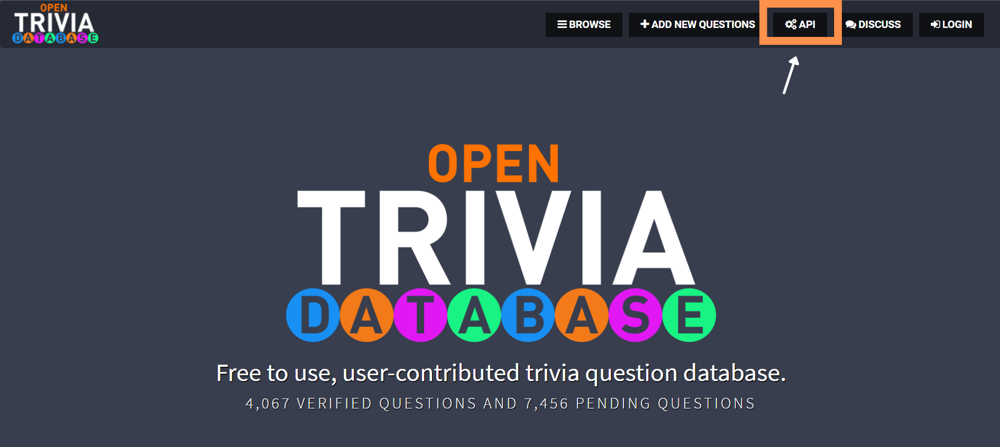

#The Quiz-Game ✔ - ✖  
A simple true-false quiz game built using **Python** completely using the concepts of **Object-Oriented Programming**.

##Game Instructions 👾  
1. The quiz-game will be asking questions to the player to which, player has to reply with either true or false.
2. Each correct answer will score a point.
3. Each time a question is answered, the current score gets updated.
4. Once all the questions have been answered, the game ends.
5. At the end of the game, the total points scored by the player are displayed.

Here's an image of the quiz-game in action:

##Setup 💻  
Contains the following:
1. main.py
2. question_model.py
3. data.py
4. quiz_brain.py  
##Let's Create 🏗️  
###Task - 1 🛠️: 
- We start off with the creation a model for a question in our quiz. To do so we use **question_model.py**.
- We create a Question class with an __ init() __ method with two attributes text and answer.

###Task - 2 🛠️:
- We can create a question_bank (containing a bunch of questions & answers) of question objects.
- In our **data.py** we have a bunch of dictionaries (in the source code we have 10 in total (you can always add more 🙈)), inside a list called question_data. We have two main keys: "question" & "correct_answer". These are the keys which we will be using throughout the program.
- Inorder to create a list of question objects we move on to **main.py**.
- We start off by importing question_model to the main.py. Moving on we create question_bank which is a list of question objects.
- We iterate over the question_data, creating a question object for each entry. At the end we append each question object (new_question) to the question_bank.

**Where to get the Questions ?** 🤔
- It's a little dry if we keep using the same one question bank again and again, sounds no fun 🥱. Well one can always look for questions on the internet, but this process can get hectic, an alternate is **[Open Trivia DataBase](https://opentdb.com/)**. 
- Click on the link and follow: API -> Select the desired options -> GENERATE API URL -> Copy the URL to new tab -> Questions in JSON Format
- Copy the data to data.py. We can format the data for increasing readability (for PyCharm: Code -> Reformat File).

###Task - 3 🛠️:
- We move on to **quiz_brain.py** which performs the following tasks: 
  1. Asking the questions.
  2. Checking if the answer was correct.
  3. Checking if we are at the end of the quiz.
- We create a QuizBrain class with an __ init() __ method with attributes question_number(default zero), question_list and method next_question().
- Then from the quiz_brain file we import the QuizBrain class and create a new quiz.

###Task - 4 🛠️:
- We add a new method called still_has_questions() to quiz_brain.py for checking the end of the quiz.
- We run a while loop in main.py, if still_has_questions() is True then next_question(), else end of quiz.

###Task - 5 🛠️:
- The last step is to check the answers inputted by player and keep the scores.
- In the quiz_brain.py we add score attribute(default zero) & check_answer() method.
- check_answer() method checks for the correct answer and displays the current score after each attempted question.
- At the end of the game we display the final scores in the main.py.

##Advantage of using OOP in the Game ⌛
- Each .py file is independent of each other, meaning we can work on each file separately any changes made in one does not affect the other. Example: We can change the content of data.py without affecting the other files.
- Each .py file has a separate functionality, hence can be reused for other projects, saving us time and extra work.
- Makes complex coding easier to work on. 

### Will add more features soon.🏃‍♀️ 🦄 Thanks for Visiting! 🦄
